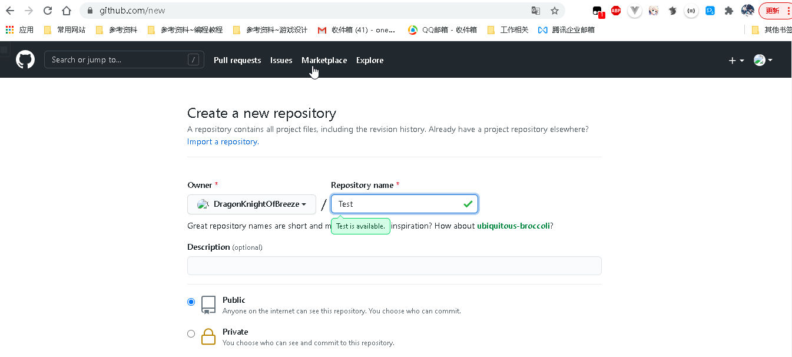
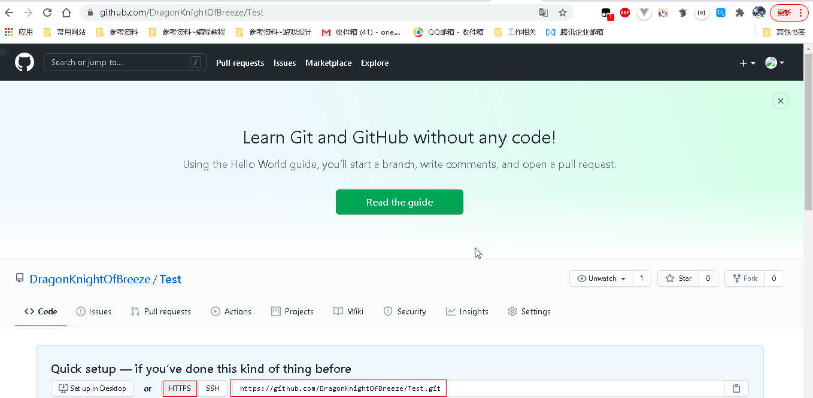

# Git学习笔记

## 简略步骤

1. 安装和配置git

```
# 下载Git并安装
# 打开命令行，确认git安装成功
git --version
# 设置git全局用户名和邮箱
git config  --global user.name xxx
git config  --global user.email xxx
# 定位到项目目录
cd xxx
```

2. 创建和配置本地的git仓库

```
# 初始化git仓库（建议添加README.md和.gitignore）
git init 
# 添加文件
git add .
# 提交文件，-m参数指定了提交信息
git commit -m "initialize rpository"
```

3. 参加和配置远程的github仓库

* 登录github网站
* 创建远程的github仓库






4. 为本地git仓库绑定远程的github仓库

```
# 需要指定url，这里使用https链接，可以从上面的截图中看到
# 图中为https://github.com/DragonKnightOfBreeze/Test.git
git remote add origin <url>
git push -u origin master
```

5. 将本地的更改同步到远程（每次本地仓库有了更改后）

```
# 添加文件
git add .
# 提交文件，-m参数指定了提交信息
git commit -m "initialize repository"
# 推送文件
git push origin
```

## 解决方案

忽略已提交的文件

```
# 删除追踪状态
git rm -r --cached .
git add . 
git commit -m "fixed untracked files"
```
  
取消提交

```
git reset --soft <revision_number>
```

## 参考链接

[Git 教程 | 菜鸟教程](https://www.runoob.com/git/git-tutorial.html)

[Git教程 - 廖雪峰的官方网站](https://www.liaoxuefeng.com/wiki/896043488029600)
